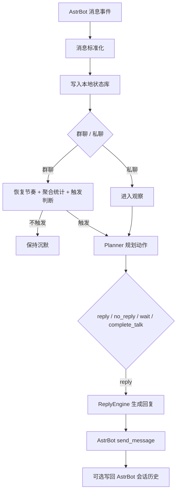

# astrbot_plugin_maibot_proactive

一个把 `MaiBot` 主动回复内核提炼为 AstrBot 插件的实现。

它不是完整复刻 `MaiBot`，而是把最有辨识度的一部分能力独立出来：

- 在群聊里保守地判断“该不该插话”
- 在私聊里保持轻量、连续的对话节奏
- 在不破坏 AstrBot 原有命令、插件、Agent 和会话流的前提下工作

## 项目定位

这个插件解决的不是“让 Bot 回得更快”，而是“让 Bot 更像一个会挑时机开口的聊天参与者”。

当前版本重点保留了 `MaiBot` 风格里的几项核心体验：

- `@bot` 或明确提及时优先接话
- 普通群聊里按节奏和概率决定是否开口
- 连续多次保持沉默后，会进一步降低插话意愿
- 长时间冷场后，会逐步恢复主动回复节奏
- 私聊中支持 `reply / wait / complete_talk`

## 核心特性

- 非拦截式设计，不接管 AstrBot 原有消息流
- 群聊保守插话，优先控制打扰感
- 动态节奏机制，综合未读热度、近期活跃度和连续沉默状态
- 本地 SQLite 状态存储
- 可选写回 AstrBot 对话历史
- 会话级覆盖能力预留

## 当前机制概览

当前实现采用“两阶段决策”：

1. 先观察消息和上下文，判断是否应该开口
2. 如果应该开口，再生成真正的回复内容

群聊节奏的核心公式是：

`effective_probability = base_talk_value * talk_frequency_adjust * heat_factor * activity_factor * silence_factor`

其中：

- `base_talk_value` 来自全局或会话覆盖配置
- `talk_frequency_adjust` 是长期节奏乘子
- `heat_factor` 反映未读有效消息数
- `activity_factor` 反映最近窗口内的群聊活跃度
- `silence_factor` 反映连续 `no_reply` 后的收敛程度

简化流程如下：



更完整的设计说明见：

- [REPLY_MECHANISM.md](./REPLY_MECHANISM.md)

## 安装方式

1. 将插件目录放入 AstrBot 工作区的 `data/plugins/`
2. 安装依赖

```bash
pip install -r requirements.txt
```

3. 在 AstrBot 中加载或重载插件

## 主要配置

基础配置：

- `enabled`
- `enable_group`
- `enable_private`
- `fallback_provider_id`
- `group_talk_value`
- `mention_force_reply`
- `group_reply_cooldown_seconds`
- `private_wait_default_seconds`
- `max_context_messages`
- `write_back_to_conversation`
- `ignore_command_like_messages`
- `blocked_origins`

节奏配置：

- `pacing_activity_window_seconds`
- `pacing_recovery_after_seconds`
- `pacing_mention_boost`
- `pacing_activity_boost`
- `pacing_reply_decay`
- `pacing_no_reply_decay`
- `pacing_frequency_min`
- `pacing_frequency_max`

这些配置的中文说明都已经写在 `_conf_schema.json` 中，可直接在 AstrBot 插件配置页查看。

## 当前边界

这仍然是一个“主动回复核心 MVP”，不是完整的 `MaiBot` 功能集合。

当前还没有实现：

- 长期记忆摘要
- 人物画像
- 黑话 / 术语学习
- 表达学习
- 复杂动作编排
- 平台原生引用消息
- 时间段 `talk_value_rules`
- 管理 UI 或群内调参命令

更准确地说，它是：

> 一个以 AstrBot 为宿主、以主动回复为中心、保留 MaiBot 节奏感的插件化实现。

## 适合谁

如果你希望 AstrBot：

- 不只是被动问答
- 在群聊里更像真实成员
- 在私聊里更有陪伴感
- 又不想破坏 AstrBot 现有插件和 Agent 体系

那么这个插件就是为这种使用场景准备的。

## 后续方向

接下来的增强方向会继续围绕“像 MaiBot，但仍然像 AstrBot 插件”这个目标推进，例如：

- 更细粒度的主动回复节奏控制
- 更稳定的人设与表达风格
- 长期记忆和上下文沉淀
- 更自然的主动社交行为
