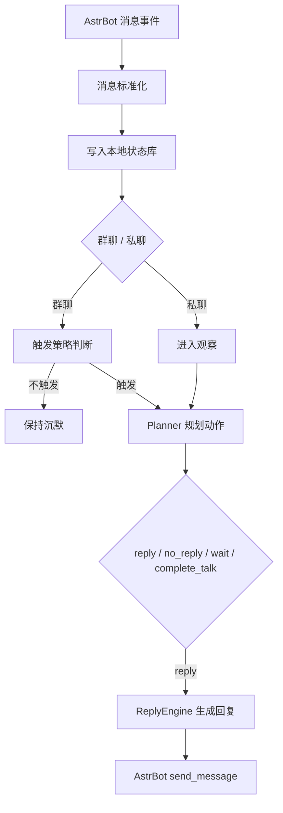

# astrbot_plugin_maibot_proactive

将 `MaiBot` 的主动回复内核提炼为一个可运行在 AstrBot 中的主动社交插件。

它不是完整复刻 `MaiBot`，而是把其中最有辨识度的一部分能力单独抽出：

- 在群聊中保守地判断“该不该插话”
- 在私聊中维持轻量、连续的对话节奏
- 在不破坏 AstrBot 原有命令、插件、Agent 和会话流程的前提下工作

## 项目目标

这个插件想解决的问题并不是“让 Bot 回得更快”，而是“让 Bot 更像一个会挑时机开口的聊天参与者”。

当前版本重点保留了 `MaiBot` 风格中的几项核心体验：

- `@bot` 或明确提及时优先接话
- 普通群聊中按概率和节奏判断是否开口
- 连续多次选择沉默后，会进一步降低插话意愿
- 私聊中不是机械秒回，而是支持 `reply / wait / complete_talk`

## 当前特性

- 保守型群聊主动回复
- 提及优先触发
- `no_reply` 反向降频
- 私聊轻量脑流
- 本地 SQLite 状态存储
- 可选写回 AstrBot 对话历史
- 非拦截式设计，尽量不打扰 AstrBot 原有生态

## 机制概览

当前实现采用“两阶段决策”：

1. 先观察消息与上下文，决定是否应该开口
2. 如果应该开口，再生成真正的回复内容

简化后的流程如下：



如果你想看更完整的设计说明，可以直接阅读：

- [REPLY_MECHANISM.md](./REPLY_MECHANISM.md)

## 安装方式

1. 将插件目录放入 AstrBot 工作区的 `data/plugins/` 下
2. 安装依赖

```bash
pip install -r requirements.txt
```

3. 在 AstrBot 中加载或重载插件

## 配置项概览

当前版本提供的核心配置包括：

- `enabled`
- `enable_group`
- `enable_private`
- `fallback_provider_id`
- `group_talk_value`
- `mention_force_reply`
- `group_reply_cooldown_seconds`
- `private_wait_default_seconds`
- `max_context_messages`
- `write_back_to_conversation`
- `ignore_command_like_messages`
- `blocked_origins`

这些配置项的中文说明已经写在插件的 `_conf_schema.json` 中，可直接在 AstrBot 插件配置页查看。

## 当前边界

这是一个主动回复核心的 MVP，因此它刻意没有一次性搬入 `MaiBot` 的全部能力。

当前尚未实现的部分包括：

- 长期记忆摘要
- 人物画像
- 黑话 / 术语学习
- 表达学习
- 复杂动作编排
- 平台原生引用消息

所以更准确地说，这个项目是：

> 一个以 AstrBot 为宿主、以主动回复为中心、保留 MaiBot 风格节奏感的插件化实现。

## 适合谁

如果你希望 AstrBot：

- 不只是“被动问答”
- 在群聊里更像真实成员
- 在私聊里更有陪伴感
- 又不想破坏 AstrBot 现有插件和 Agent 体系

那么这个插件就是为这种使用场景准备的。

## 后续方向

后续版本计划逐步补回更多 `MaiBot` 风格能力，例如：

- 更细粒度的主动回复频率控制
- 更稳定的人设与表达风格
- 长期记忆与上下文沉淀
- 更丰富的主动社交行为

## 许可证

当前仓库已包含 `LICENSE` 文件，请根据你希望对外发布的方式继续维护许可证内容。
