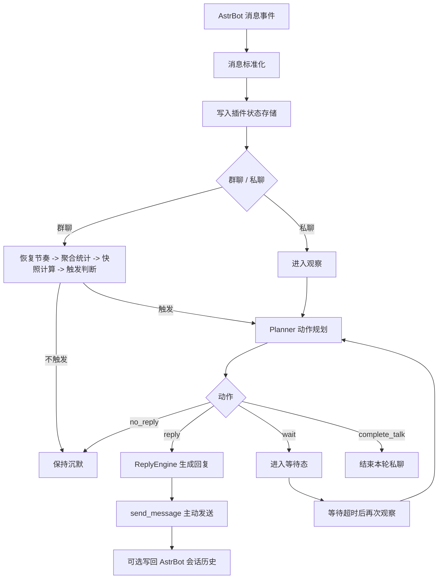

# 回复机制说明

## 概览

`astrbot_plugin_maibot_proactive` 不是把 `MaiBot` 整个框架搬进 AstrBot，而是提炼出了其中最核心的“主动回复”能力，并以 AstrBot 插件的形式重新实现。

当前版本的定位很明确：

- 一个保守型、非拦截式的主动回复插件
- 一个运行在 AstrBot 宿主内部的“主动社交层”
- 一个聚焦主动回复核心体验的 MVP，而不是完整的 `MaiBot` 复刻

它遵循三个原则：

- 只监听消息，不接管 AstrBot 主流程
- 只在合适的时候开口，不追求高频刷存在感
- 优先复用 AstrBot 现有会话、模型和 persona 体系

## 整体流程

一句话概括就是：

> 先观察，再决定要不要说话，最后才生成真正的回复。

## 1. 事件接入方式

插件通过 AstrBot 的消息事件进行监听，因此它可以看到群聊和私聊中的消息。

但这个插件最重要的兼容原则是：

- 它只“观察”消息
- 不“拦截”消息

也就是说，消息进入本插件之后，仍然会继续流向 AstrBot 原有的命令、插件、Agent 和会话系统。这个插件只是额外决定“是否需要主动插一句话”。

## 2. 消息标准化

进入插件后的消息会先被转成统一结构，核心字段包括：

- `unified_msg_origin`
- `message_id`
- `sender_id`
- `sender_name`
- `chat_type`
- `raw_summary`
- `is_mentioned`
- `is_command_like`
- `is_low_signal`

为了让后续规划和生成都能稳定处理，多模态消息会先被转成简化文本标记：

- 图片 -> `[image]`
- 语音 -> `[voice]`
- 视频 -> `[video]`
- 表情 -> `[emoji]`
- 戳一戳 -> `[poke]`

所以从 Planner 和 ReplyEngine 的视角看，上下文不是平台原始消息，而是一份统一、文本化的聊天摘要。

## 3. 前置过滤

不是所有消息都会进入主动回复判定。

当前版本会先过滤：

- 插件已关闭
- 当前会话在 `blocked_origins` 中
- bot 自己发送的消息
- 命令样式消息
- 低信息量消息

其中低信息量消息包括：

- 空消息
- 纯媒体标记
- 极短无意义消息
- 短时间内重复的人类消息

这层过滤会优先减少对 AstrBot 原有命令流和普通聊天环境的打扰。

## 4. 群聊回复机制

群聊不是“看见消息就回”，而是“判断现场是否值得接话”。

### 4.1 群聊触发顺序

每条群消息进入后，会按以下顺序处理：

1. 写入本地状态库
2. 如果是有效人类消息，先执行节奏恢复
3. 聚合群聊最近统计信息
4. 根据提及和活跃度更新 `talk_frequency_adjust`
5. 计算当前节奏快照
6. 根据冷却、未读门槛和最终概率决定是否进入观察

### 4.2 节奏快照

当前版本把群聊的节奏因素统一汇总成 `PacingSnapshot`。

核心字段包括：

- `base_talk_value`
- `talk_frequency_adjust`
- `heat_factor`
- `activity_factor`
- `silence_factor`
- `effective_probability`
- `reason_tags`

最终概率为：

`effective_probability = base_talk_value * talk_frequency_adjust * heat_factor * activity_factor * silence_factor`

并裁剪在 `[0.0, 1.0]` 范围内。

### 4.3 各节奏因子的含义

`base_talk_value`

- 来自全局 `group_talk_value`
- 如果会话启用了覆盖，则优先使用会话覆盖值

`talk_frequency_adjust`

- 群聊长期节奏乘子
- 反映 bot 最近这段时间“更想说话”还是“更克制”

`heat_factor`

- 基于自上次观察以来的未读有效人类消息数
- 1 条未读：`1.00`
- 2 条未读：`1.08`
- 3 条及以上：`1.15`

`activity_factor`

- 基于活跃窗口内的人类消息密度
- 1 条：`0.95`
- 2-3 条：`1.00`
- 4-6 条：`1.08`
- 7 条及以上：`1.15`

`silence_factor`

- 基于 `consecutive_no_reply_count`
- 0-2 次连续沉默：`1.00`
- 3-4 次：`0.92`
- 5 次及以上：`0.82`

### 4.4 未读门槛

除了概率机制，当前版本还保留了 MaiBot 风格的未读门槛逻辑：

- `consecutive_no_reply_count < 3`：通常只要求至少 1 条未读
- `consecutive_no_reply_count >= 3`：50% 概率要求至少 2 条未读
- `consecutive_no_reply_count >= 5`：要求至少 2 条未读

这意味着连续多次保持沉默后，bot 之后会变得更谨慎，而不是因为概率波动频繁试探性开口。

### 4.5 `talk_frequency_adjust` 如何变化

当前版本只对群聊动态更新这个乘子：

- 人类消息明确提及 bot：`+0.20`
- 最近活跃窗口达到热聊阈值，且不在冷却中：`+0.06`
- 实际主动回复成功：`-0.18`
- Planner 选择 `no_reply`：`-0.08`
- provider 缺失、生成失败、重复回复抑制导致未发出：`-0.08`

不会因为单次“概率未命中”直接扣分，避免 bot 在普通闲聊群中越沉默越不敢开口。

### 4.6 长时间冷场后的恢复

当前版本补上了长冷场恢复机制：

- 如果会话距离最近一次观察或主动发言已经超过恢复时间：
  - `consecutive_no_reply_count` 会被重置为 `0`
- 如果距离上次 bot 主动发言已经超过恢复时间，且当前收到新的有效人类消息：
  - 若 `talk_frequency_adjust < 1.0`，则朝 `1.0` 回拉一步
  - 默认每次回拉 `+0.05`

这个恢复逻辑不会通过后台定时器执行，而是在新的群消息到来时自然发生。

### 4.7 冷却与强触发

群聊里有两条很重要的上层规则：

- 如果明确提及 bot，并且 `mention_force_reply = true`，则直接进入观察
- 如果还在群聊回复冷却时间内，则不进入普通概率触发

这样可以同时保证：

- 被点名时反应足够直接
- 刚说完话时不会马上连着插第二句

## 5. 私聊回复机制

私聊没有采用概率插话，而是一个轻量状态机。

### 5.1 私聊允许的动作

私聊 Planner 当前只允许输出：

- `reply`
- `wait`
- `complete_talk`

### 5.2 私聊工作方式

- 收到一条正常私聊消息，就进入一次观察
- 如果当前处于 `wait`，新消息会立刻打断等待并重新规划
- `wait` 到时后会再次进入观察
- `complete_talk` 表示本轮结束，直到下一条消息再恢复

这让私聊行为比群聊更连续，但仍然保留了“先判断要不要继续接话”的节奏感。

## 6. Planner 机制

插件没有把“是否回复”和“回复什么”混在一起，而是保留了 MaiBot 的两阶段思路。

第一阶段由 `PlannerEngine` 决定动作。

### 6.1 Planner 输入

当前 Planner 会读取：

- 当前会话类型
- 最近消息窗口
- 最近几条动作记录
- 当前触发原因

### 6.2 Planner 输出

Planner 必须输出一个 JSON 对象，字段包括：

- `action`
- `target_message_id`
- `reason`
- `unknown_words`
- `question`
- `quote`
- `wait_seconds`

动作范围按场景限制：

- 群聊：`reply / no_reply`
- 私聊：`reply / wait / complete_talk`

### 6.3 Planner 保护逻辑

当前版本有多层回退：

- LLM 调用失败
- 输出不是合法 JSON
- 输出动作不在允许集合内
- 目标消息是 bot 自己的消息

出现以上任一情况时会自动回退为：

- 群聊：`no_reply`
- 私聊：`wait`

这使得插件在模型输出不稳定时，仍然优先表现为克制，而不是乱说话。

## 7. ReplyEngine 机制

第二阶段由 `ReplyEngine` 负责生成真正发出去的内容。

### 7.1 ReplyEngine 输入

ReplyEngine 当前会组合：

- 最近消息窗口
- Planner 选中的目标消息
- Planner 的 `reason`
- `question`
- `unknown_words`
- 当前 persona 名称
- 当前会话类型

### 7.2 回复风格

当前 prompt 已经区分群聊与私聊：

- 群聊：短、自然、像聊天，不要像客服
- 私聊：更连续、更像真实对话

同时还附带这些约束：

- 群聊尽量控制在 1-2 句
- 不解释“为什么这么回复”
- 不输出 JSON
- 不主动提及系统、插件或 Planner

### 7.3 `quote` 的当前含义

`quote` 目前不是平台原生引用消息。

当前版本里它更接近一种风格控制：

- 如果 `quote = true`
- 且目标消息是人类消息

最终文本会被格式化成：

`发送者名: 回复内容`

所以它更像“点名接话”，而不是平台级引用。

## 8. 模型与 Persona 复用

插件不会维护一套独立模型体系，而是优先复用 AstrBot 宿主上下文。

### 8.1 provider 选择顺序

当前顺序是：

1. 先读取当前会话绑定的 provider
2. 如果取不到，再使用 `fallback_provider_id`

如果两者都不可用：

- 群聊记一次 `no_reply`
- 私聊清理等待态
- 本轮不发送主动回复

### 8.2 persona 复用

如果当前会话已有 AstrBot 对话且绑定了 persona，插件会把 persona 名称带入回复 prompt；否则按普通会话处理。

## 9. 存储与上下文

当前版本的上下文不是只存在内存里，而是依赖插件自己的 SQLite 状态库。

### 9.1 核心表

插件当前维护三张核心表：

- `chat_sessions`
- `recent_messages`
- `action_records`

### 9.2 各自保存什么

`chat_sessions`

- 会话类型
- 上次观察时间
- 上次主动回复时间
- 连续 `no_reply` 次数
- `talk_frequency_adjust`
- 当前状态，如 `idle` 或 `waiting:*`

`recent_messages`

- 最近消息
- 发送者信息
- 是否 bot 消息
- 是否提及
- 是否命令样式
- 是否低信息量
- 文本摘要

`action_records`

- 最近规划动作
- 动作原因
- 目标消息
- 动作摘要

### 9.3 群聊统计聚合

存储层当前还会提供一组只读聚合数据，用于群聊节奏计算：

- 自上次观察以来的未读有效人类消息数
- 活跃窗口内的有效人类消息数
- 最近一条有效人类消息时间

统计会排除：

- bot 消息
- 命令样式消息
- 低信息量消息

## 10. 与 AstrBot 宿主的兼容方式

插件遵循的是“尽量贴近宿主，但不接管宿主”的原则。

### 10.1 当前已做的兼容

- 使用 AstrBot 的 `send_message` 主动发消息
- 使用 AstrBot 的 `llm_generate` 调用模型
- 如果当前会话已存在对话，则尝试把“触发消息 + 主动回复”写回 AstrBot 对话历史

### 10.2 明确不做的事

- 不主动创建新对话
- 不切换当前对话
- 不直接调用工具型 Agent
- 不接管 AstrBot 的命令流

所以这个插件更像宿主能力的增强层，而不是替代宿主主流程的新框架。

## 11. 当前边界

为了避免误解，这里明确列出当前还没有落地的能力：

- 长期记忆摘要
- 人物画像
- 黑话 / 术语学习
- 表达学习
- 复杂动作编排
- 平台原生引用消息
- 时间段 `talk_value_rules`
- 管理 UI 或群内调参命令

也就是说，当前版本描述的是“已经实现的主动回复内核”，而不是完整的 `MaiBot` 能力集合。

## 12. 总结

当前版本的 `astrbot_plugin_maibot_proactive`，本质上是一个：

> 以 AstrBot 为宿主、以 SQLite 维护短期状态、通过两阶段 LLM 决策实现保守型主动接话，并带有 MaiBot 风格节奏控制的主动回复插件。

它已经具备的核心能力包括：

- 群聊中的克制插话
- 私聊中的轻量连续对话
- 基于热度、活跃度和沉默状态的动态节奏
- 与 AstrBot 原有会话、模型和生态的兼容

接下来的演进方向，会继续围绕长期记忆、表达风格和更自然的主动社交行为展开。
