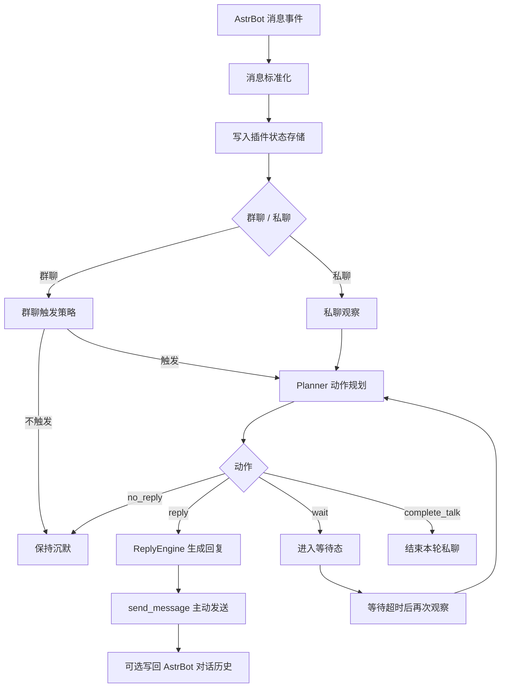

# 回复机制说明

## 概览

`astrbot_plugin_maibot_proactive` 并不是将 `MaiBot` 整个框架直接移植到 AstrBot 中，而是提炼了其中最核心的“主动回复”能力，并以 AstrBot 插件的形式重新实现。

当前版本的定位是：

- 一个保守型、非拦截式的主动回复插件
- 一个运行在 AstrBot 宿主内部的“主动社交层”
- 一个聚焦主动回复核心体验的 MVP，而不是完整的 `MaiBot` 复刻

它的基本原则很明确：

- 只监听消息，不接管 AstrBot 主流程
- 只在合适的时机开口，不追求高频刷存在感
- 优先复用 AstrBot 现有会话、模型和人格体系

## 整体流程

可以把当前机制概括为一句话：

> 先观察，再决定是否说话，最后才生成真正的回复。

## 1. 事件接入方式

插件通过 AstrBot 的全消息事件进行监听，因此它可以看见群聊和私聊中的所有消息。

但这里有一个非常关键的设计点：

- 它只“观察”消息
- 不“拦截”消息

也就是说，消息进入本插件后，依然会继续流向 AstrBot 原本的命令、插件、Agent 和会话系统。  
这也是当前插件最重要的兼容性基础。

## 2. 消息标准化

进入插件后的消息，会先被转换为统一结构，核心字段包括：

- `unified_msg_origin`
- `message_id`
- `sender_id`
- `sender_name`
- `chat_type`
- `raw_summary`
- `is_bot`
- `is_mentioned`
- `is_command_like`

为了方便后续规划和生成，插件会把多种消息内容转成简化的文本标记：

- 图片 -> `[image]`
- 语音 -> `[voice]`
- 视频 -> `[video]`
- 表情 -> `[emoji]`
- 戳一戳 -> `[poke]`

所以从 Planner 和 ReplyEngine 的视角看，上下文并不是原始平台消息，而是一份经过整理的“文本化消息摘要”。

## 3. 基础过滤规则

并不是所有消息都会进入主动回复判断。

当前版本会先过滤以下内容：

- 插件已关闭
- 当前会话在 `blocked_origins` 黑名单中
- 机器人自己发送的消息
- 命令样式消息

命令样式消息目前采用比较保守的判断方式，默认检查以下前缀：

- `/`
- `!`
- `.`
- `#`

这样可以尽量减少对 AstrBot 原有命令流的打扰。

## 4. 群聊回复机制

群聊采用的是“保守插话”逻辑，而不是“看到消息就回”。

### 4.1 群聊触发顺序

每条群消息进入后，会经历以下判断过程：

1. 先写入本地状态库
2. 如果显式提及机器人，并且 `mention_force_reply = true`，直接触发观察
3. 如果仍在冷却期内，则保持沉默
4. 根据近期连续 `no_reply` 次数，提高触发门槛
5. 统计自上次观察以来的未读人类消息数
6. 按 `group_talk_value` 概率决定是否进入规划

### 4.2 no_reply 反向降频

当前实现保留了 `MaiBot` 风格里很重要的一点：  
如果 bot 连续多次判断“不该开口”，之后会变得更谨慎。

目前的行为是：

- 当 `consecutive_no_reply_count < 3` 时，通常只要求至少 1 条未读人类消息
- 当 `consecutive_no_reply_count >= 3` 时，开始提高触发门槛
- 当 `consecutive_no_reply_count >= 5` 时，通常需要至少 2 条未读人类消息

这个机制的作用，不是让 bot 更沉默，而是避免它在不合适的时候频繁插话。

### 4.3 当前群聊机制的边界

插件内部已经预留了 `talk_frequency_adjust` 字段，并且触发公式也会使用：

`group_talk_value * talk_frequency_adjust`

但当前版本还没有实现对 `talk_frequency_adjust` 的动态调节逻辑，因此它目前基本保持默认值 `1.0`。

所以现阶段可以这样理解：

- 已实现：提及强触发、冷却、`no_reply` 反向降频、概率触发
- 未完全实现：更细粒度的动态社交活跃度控制

## 5. 私聊回复机制

私聊不是概率插话，而是一个轻量的“脑流状态机”。

### 5.1 私聊允许的动作

私聊 Planner 当前只允许输出三种动作：

- `reply`
- `wait`
- `complete_talk`

### 5.2 私聊工作方式

当前私聊逻辑如下：

- 收到一条正常私聊消息，就进入一次观察
- 如果此时正处于 `wait` 状态，新消息会立刻打断等待并重新规划
- 如果 Planner 选择 `wait`，插件会在指定秒数后再次观察
- 如果 Planner 选择 `complete_talk`，本轮私聊结束，直到新消息再次到来

这让私聊行为相比群聊更连续，但仍保留“先判断要不要继续接话”的节奏感。

## 6. Planner 规划机制

插件没有把“是否回复”和“回复什么”混在一起，而是保留了 `MaiBot` 的两阶段思路。

第一阶段由 `PlannerEngine` 决定动作。

### 6.1 Planner 的输入

当前 Planner 会读取以下信息：

- 当前会话类型：群聊或私聊
- 最近消息窗口
- 最近几条动作记录
- 当前触发原因

### 6.2 Planner 的输出

Planner 必须输出一个 JSON 对象，字段包括：

- `action`
- `target_message_id`
- `reason`
- `unknown_words`
- `question`
- `quote`
- `wait_seconds`

其中动作范围会按场景限制：

- 群聊：`reply` / `no_reply`
- 私聊：`reply` / `wait` / `complete_talk`

### 6.3 Planner 的保护逻辑

为了保证行为稳定，当前实现加了多层回退：

- LLM 调用失败
- 输出不是合法 JSON
- 输出动作不在允许集合中
- 目标消息是 bot 自己的消息

以上任一情况出现时，会自动回退为：

- 群聊：`no_reply`
- 私聊：`wait`

因此这个插件即使在模型状态不稳定时，也会优先表现为“克制”，而不是“乱说”。

## 7. ReplyEngine 回复生成机制

第二阶段由 `ReplyEngine` 负责生成真正发出去的话。

### 7.1 回复生成输入

ReplyEngine 当前会结合以下内容构造 prompt：

- 最近消息窗口
- Planner 选中的目标消息
- Planner 给出的 `reason`
- `question`
- `unknown_words`
- 当前 persona 名称
- 当前会话类型

### 7.2 回复风格控制

当前 prompt 已经区分群聊与私聊：

- 群聊：短、自然、像聊天，不要像客服
- 私聊：更连续、更像真实对话

同时还附带这些约束：

- 群聊尽量控制在 1-2 句
- 不解释“为什么这样回复”
- 不输出 JSON
- 不主动提及系统、插件或规划器本身

### 7.3 quote 的当前实现

`quote` 目前不是平台级引用消息。

它在当前版本中的含义更接近一种风格提示：

- 如果 `quote = true`
- 且找得到目标消息的发送者

最终文本会被格式化为：

`发送者名: 回复内容`

所以它更像“点名接话”，而不是平台原生引用。

## 8. 模型与 Persona 复用机制

插件不会单独维护一套完整模型体系，而是优先复用 AstrBot 宿主上下文。

### 8.1 provider 选择顺序

插件当前按以下顺序选择模型：

1. 先尝试读取当前会话绑定的 provider
2. 如果取不到，再使用 `fallback_provider_id`

如果两者都不可用：

- 群聊会记一次 `no_reply`
- 私聊会清空等待态
- 本轮不发送主动回复

### 8.2 persona 处理方式

如果当前会话已经存在 AstrBot 对话，并且绑定了 persona，那么插件会把 persona 名称带入回复 prompt。  
如果没有，则按普通会话处理。

## 9. 上下文与存储机制

当前版本的上下文并不是单纯存在内存里，而是依赖插件自己的 SQLite 状态库。

### 9.1 当前数据表

插件维护三张核心表：

- `chat_sessions`
- `recent_messages`
- `action_records`

### 9.2 分别保存什么

`chat_sessions`

- 会话类型
- 上次观察时间
- 上次主动回复时间
- 连续 `no_reply` 次数
- 当前状态，如 `idle` 或 `waiting:*`

`recent_messages`

- 最近消息
- 发送者信息
- 是否是 bot 消息
- 是否提及
- 是否命令样式
- 文本摘要

`action_records`

- 最近的规划动作
- 动作原因
- 对应目标消息

### 9.3 上下文窗口

配置项 `max_context_messages` 决定每次规划和回复时读取多少最近消息。  
数据库层会保留一个稍大的缓冲窗口，以避免上下文窗口频繁抖动。

## 10. 与 AstrBot 会话系统的兼容方式

插件遵循的是“尽量贴近宿主，但不接管宿主”的原则。

### 10.1 当前已经做的兼容

- 使用 AstrBot 的 `send_message` 主动发消息
- 使用 AstrBot 的 `llm_generate` 调用模型
- 如果当前会话已经存在对话，则尝试把“触发消息 + 主动回复”补写回 AstrBot 对话历史

### 10.2 当前明确不做的事情

- 不主动创建新对话
- 不切换当前对话
- 不直接调用工具型 Agent
- 不接管 AstrBot 的命令流

这让插件更像是宿主能力的增强层，而不是替代宿主主流程的新框架。

## 11. 当前版本尚未实现的部分

为了避免误解，这里明确列出当前还没有落地的能力：

- 长期记忆摘要
- 人物画像
- 黑话 / 术语学习
- 表达学习
- 复杂动作编排
- 平台原生引用消息
- 更精细的动态频率调节
- 每个会话独立 UI 调参

也就是说，当前版本描述的是“已经实现的主动回复内核”，而不是完整的 `MaiBot` 功能集合。

## 12. 总结

当前版本的 `astrbot_plugin_maibot_proactive`，本质上是一个：

> 以 AstrBot 为宿主、以 SQLite 维护短期状态、通过两阶段 LLM 决策实现保守型主动接话的 MaiBot 风格主动回复插件。

它已经具备的核心能力包括：

- 群聊中的克制插话
- 私聊中的轻量连续对话
- 与 AstrBot 原有会话、模型和生态的兼容

而它接下来的演进方向，则会是把 `MaiBot` 中更复杂的长期记忆、表达学习与社交细节逐步补回来。
